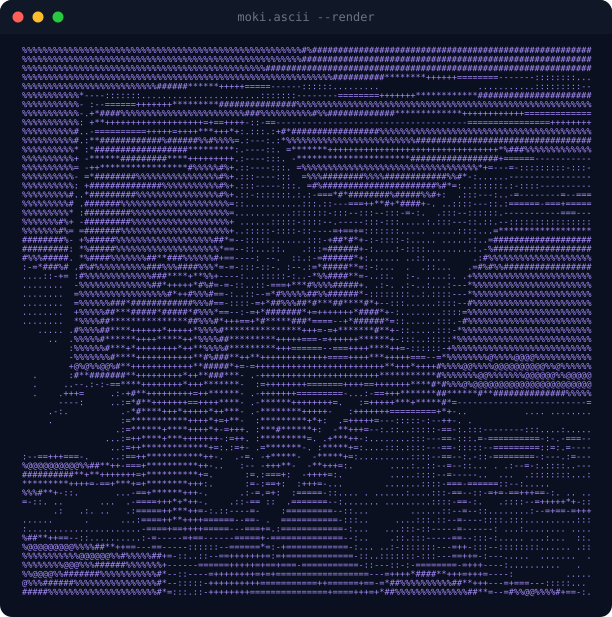

  <picture>
    <source media="(prefers-color-scheme: dark)" srcset="assets/banner-dark.svg">
    <source media="(prefers-color-scheme: light)" srcset="assets/banner-light.svg">
    
  </picture>

<h1 align="center">Hi 👋, I'm Tanmay Tripathi</h1>

🎓 B.Tech CSE @ Central University of Jammu  
💻 Aspiring AI/ML & Full-Stack Developer  
🚀 Building real-world projects & improving every day

---

## 👨‍💻 About Me
- 🎓 Computer Science Engineering student
- 💡 Interested in **AI/ML, Web Development & Core CS**
- 🧠 Strong fundamentals in **DSA, OS, DBMS**
- 🛠 Love building **practical & scalable projects**
- 🚀 Focused on **clean code, consistency & growth**

---

## 🛠 Tech Stack
**Languages:**
`C` `C++` `Python` `JavaScript` `TypeScript`

**Frontend:**
`HTML` `CSS` `React` `Next.js` `Tailwind CSS`

**Backend & Tools:**
`Node.js` `Express.js` `PostgreSQL` `Git` `GitHub` `Vercel`

**Core CS:**
`DSA` `OS` `DBMS`

---

## 🚀 Projects

### 🧠 Cognify
🔗 Repo: https://github.com/Tanmay2006-Tech/Cognify
🌐 Live: https://cognify-liart-five.vercel.app
* Production-grade AI SaaS that turns student marks into explainable performance forecasts with confidence scores
* Built a custom prediction engine with trend fitting, what-if simulator & factor-level explainability
* Features a personalized weekly study planner, gamification system (XP, streaks, badges) & voice-enabled AI coach
* Role-based mentor workspace with multi-format report exports (JSON, CSV, PDF)
* **Stack:** Next.js 14 · Prisma · PostgreSQL · Clerk · Framer Motion · Recharts · Zod

---

### 🕵️ NullTrace
🔗 Repo: https://github.com/Tanmay2006-Tech/NullTrace-Final
🌐 Live: https://null-trace-final-nulltrace.vercel.app
* Full-stack AI DevOps observability platform — real-time war room for infrastructure monitoring
* AI root cause analysis engine with confidence scores & auto-generated kubectl remediation commands
* Live incident feed, service health heatmap, searchable log stream & plain-English AI chat assistant
* Contract-first API design with OpenAPI 3.0 + Orval codegen keeping client & server perfectly in sync
* **Stack:** React 19 · Express 5 · PostgreSQL · Drizzle ORM · TypeScript · Tailwind v4

---

### 🔍 RepoScan
🔗 Repo: https://github.com/Tanmay2006-Tech/RepoScan
🌐 Live: https://repo-scan-kappa.vercel.app
* Full-stack GitHub repository analysis tool with a clean developer-focused UI
* Scans and surfaces repo insights with fast, structured data presentation
* **Stack:** React · TypeScript · Node.js · Tailwind CSS

---

### 🏥 Upchaar
🔗 Repo: https://github.com/Tanmay2006-Tech/Upchaar
🌐 Live: https://upchaar-nine.vercel.app
* Healthcare web platform designed for better patient accessibility & user experience
* Built with modern TypeScript frontend practices and a focus on clean, intuitive UI
* **Stack:** TypeScript · React · Tailwind CSS

---

### 🧪 RetainIQ
🔗 Repo: https://github.com/Tanmay2006-Tech/RetainIQ
* Python AI/ML project exploring intelligent retention and data-driven decision making
* Hands-on implementation of ML concepts with clean, structured code
* **Stack:** Python

---

### ⚡ EchoForge-AI
🔗 Repo: https://github.com/Tanmay2006-Tech/EchoForge-AI
🌐 Live: https://echo-forge-ai.vercel.app
* AI-powered generative platform built in JavaScript
* Focused on intelligent content generation and AI-driven output workflows
* **Stack:** JavaScript · Node.js

---

## 🐈 Moki, in ASCII

  <picture>
    <source media="(prefers-color-scheme: dark)" srcset="assets/ascii-dark.svg">
    <source media="(prefers-color-scheme: light)" srcset="assets/ascii-light.svg">
    
  </picture>

---

## 📊 GitHub Stats

  
  

  

> ⚠️ These currently point at the **public** github-readme-stats instance, which rate-limits constantly. Swap the base URL for your self-hosted Vercel deployment once it's live (see checklist below) — same query params, just your own domain.

---

## 🐍 Contribution Snake

  <picture>
    <source media="(prefers-color-scheme: dark)" srcset="https://raw.githubusercontent.com/Tanmay2006-Tech/Tanmay2006-Tech/output/snake-dark.svg">
    <source media="(prefers-color-scheme: light)" srcset="https://raw.githubusercontent.com/Tanmay2006-Tech/Tanmay2006-Tech/output/snake-light.svg">
    
  </picture>

---

## 📫 Connect With Me

  &nbsp;&nbsp;
  

---

## ✨ Quote

<i>Build consistently. Improve continuously. 🚀</i>

